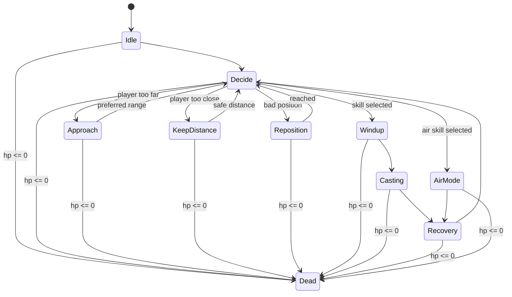

# Boss AI 自动机文档 — MirrorAngel Boss (Stage 55)

> 本文档为 **Boss AI 自动机审计与可视化** 产物（Stage 55）。
> 本轮 **不重写 Boss、不改技能数值、不破坏 BossRoom**，仅整理结构、新增状态枚举与运行时监控、输出文档。

---

## 1. Boss AI 总体目标

`MirrorAngelBoss` 是 BossRoom 的唯一 Boss，战斗根为 `MirrorSaintessBoss`（总 HP=400 / Phase1→Phase2→Dead）。
AI 的目标是：

- 维持与玩家的**理想交战距离**（不贴脸、不站桩），太远靠近、太近后撤。
- 按**决策间隔**周期性决策，而非「CD 一好立刻放」。
- 用**评分制候选池**在多个技能中择优，避免单调重复。
- 通过**统一动作锁（ActionLock）+ token** 保证同一时刻只有一个技能在跑，且不被移动 / 旧协程抢占。
- 死亡时**立即中断**一切动作与协程。

---

## 2. 模块职责

所有脚本位于 `Assets/Scripts/Boss/`，命名空间 `Cardwin.Boss`（战斗根 `MirrorSaintessBoss` 属 `MirrorSaintessBossPack`）。组件全部挂在 Boss 根 `MirrorAngelBoss` 上（`Body` 子物体仅持视觉 + Hurtbox）。

| 模块 | 职责 | 写 Animator | 写 Rigidbody2D | 启动技能 | 尊重 ActionLock |
|---|---|---|---|---|---|
| **BossBrain** (`MirrorAngelBossBrain`) | AI 大脑：距离判断 / 决策间隔 / 评分选技 / 攻击概率 / 移动行为（Approach/KeepDistance/Reposition）/ 前后摇协程 | 否（经 mover/AC） | 否 | **是**（`BeginAction`→`skill.TryCast`） | 是（`Update` 检查 `IsActionLocked`） |
| **ActionController** (`MirrorAngelBossActionController`) | 统一动作仲裁：`BeginAction(type)`→token / `EndAction(token)` / `ForceCancelAction()` / `AllowSkillMotion`。持有 `IsCasting`/`AttackType`、movementLock、facingLock | 是（`IsCasting`/`AttackType`） | 否（经 mover） | 否（只授权） | **本体即锁** |
| **Skill** (Triple­Beam / GroundRay / DoubleSlash / DoubleSlashDash / AirLaser) | 单技能执行：`TryCast()`→协程（前摇/伤害/位移/特效/后摇），`IsCasting` 只读 | 是（部分直接 `animator.Play`） | 部分（DashDash 用 `MovePosition`，AirLaser 全控 RB） | self 协程 | 间接（被 Brain 的 Begin/End 包裹） |
| **AnimatorBridge** (`MirrorAngelBossAnimatorBridge`) | 纯视觉桥接：每帧由 boss/mover 只读态写 `MoveSpeed/IsGrounded/IsFlying/IsDashing/IsCasting/IsDead` | **是** | 否 | 否 | 是（锁定时 `return`，不覆盖技能动画） |
| **GravityMover** (`MirrorAngelBossGravityMover`) | Dynamic 重力运动：地面巡逻 / 靠近 / 边界钳制；Brain 活动时让出方向控制（用 `DesiredMoveX`）；Dead / Phase2 过渡 / movementLock / AirLaser 时停 | 否 | **是**（`velocity`/`MovePosition`） | 否 | 是（AirLaser & lock 分支让出） |
| **DamageReceiver** (`MirrorAngelBodyDamageReceiver`) | `Body` 命中盒，实现 `IDamageable.TakeHit` → 经 EffectReceiver/owner 扣总 HP（护盾感知） | 否 | 否 | 否 | N/A |
| **DebugState** (`MirrorAngelBossDebugState`) *(Stage 55 新增)* | 运行时状态监控（仅可视化）：CurrentState/Skill/Distance/ActionLocked/Token/IsDead/AirMode；状态变化低频日志；Scene 文字 | 否 | 否 | 否 | 只读取 |

---

## 3. 状态表

可视化状态枚举 `BossAIState`（`Assets/Scripts/Boss/BossAIState.cs`，Stage 55 新增）：

| # | 状态 | 含义 |
|---|---|---|
| 0 | `Idle` | 短暂停顿 / 初始静止，等待下一次决策 |
| 1 | `Decide` | 决策时刻：评估距离与技能候选池 |
| 2 | `Approach` | 玩家太远，向玩家移动靠近 |
| 3 | `KeepDistance` | 距离合适，保持距离不动 |
| 4 | `Reposition` | 玩家太近，向远离方向后撤 |
| 5 | `Windup` | 技能前摇（已锁定动作） |
| 6 | `Casting` | 技能释放（伤害 / 位移 / 特效） |
| 7 | `Recovery` | 技能后摇 / 解锁 |
| 8 | `AirMode` | 飞天悬停激光模式（AirLaserMode 专属） |
| 9 | `Dead` | 死亡，停止一切 AI（终态） |

> 注：Brain 内部仍保留自己的运行枚举 `MirrorAngelBossBrainState`（无 `Decide`/`AirMode`）。`BossAIState` 为可视化层，Brain 在既有转换点把状态镜像给 `MirrorAngelBossDebugState`，**不改变任何决策逻辑**。

---

## 4. 每个状态明细

| 状态 | 进入条件 | 退出条件 | 能否移动 | 能否释放技能 | 能否被打断 | Animator 同步 |
|---|---|---|---|---|---|---|
| **Idle** | Start / 技能或位移结束回归 | 决策间隔（0.5~1.2s）到 → Decide | 否（DesiredMoveX=0） | 否 | 死亡可直接转 Dead | `MoveSpeed=0` → Idle |
| **Decide** | Idle 决策间隔到，`DecideNextAction()` 入口 | 立即转 Approach / KeepDistance / Reposition / Windup / AirMode | 否（瞬时） | 评估并可能启动 | 死亡 | 沿用 Idle（无专门动画） |
| **Approach** | `dist > preferredMaxDistance` 且本次不放技能 | `dist <= preferredMaxDistance` → Idle | **是**（朝玩家方向） | 否（移动期间） | 死亡 | `MoveSpeed>0` → Walk |
| **KeepDistance** | 距离合适但放弃攻击（attackChance 未中）或 `preferredMin<dist<=preferredMax` | 下次决策 → Decide | 否 | 否（本次） | 死亡 | Idle |
| **Reposition** | `dist < tooCloseDistance(2.5)` | 后撤计时（0.4~0.8s）到 → Idle | **是**（远离玩家） | 否 | 死亡 | Walk |
| **Windup** | 决策选中技能 **且 `BeginAction` 返回有效 token** | `skill.TryCast()` 成功 → Casting | 否（brainMovementLock + AC movementLock） | 已锁定该技能 | 死亡 → `ForceCancelAction` | `IsCasting=true` + `AttackType=N` |
| **Casting** | `skill.TryCast()` 返回 true | `skill.IsCasting` 变 false → Recovery | 技能内部决定（多数否；Dash/Air 例外） | 进行中（独占） | 死亡 → 技能 `Aborted()` + `ForceCancel` | 对应技能动画（AttackType） |
| **Recovery** | 技能协程 `finally` 结束 | 立即 → Idle（下一帧 → Decide） | 否（刚解锁） | 否 | 死亡 | `AttackType=0`，回 Idle |
| **AirMode** | 选中 `AirLaserMode` 并进入 Casting | AirLaser 协程结束 → Recovery | 技能内部（空中漂浮 / 横移 / 冲刺） | AirLaser 子状态机（Rise/Hover/Move/Dash/Laser/Exit） | 死亡 → `EndCastDeath` | `IsFlying` + `AirSubType` |
| **Dead** | `boss.IsDead == true` | 无（终态） | 否 | 否 | N/A | `IsDead=true` → Death |

**距离参数（实际序列化值）**：`tooCloseDistance=2.5` / `preferredMinDistance=4` / `preferredMaxDistance=7` / `farDistance=10`。
**决策参数**：`decisionIntervalMin=0.5` / `decisionIntervalMax=1.2` / `attackChance=0.65`。

---

## 5. Mermaid 状态图

---

## 6. 当前实现 vs 理想实现差距

| 项目 | 当前实现 | 理想实现 | 差距 |
|---|---|---|---|
| 状态权威源 | 两个枚举：`MirrorAngelBossBrainState`（运行）+ `BossAIState`（可视化），由 Brain 桥接 | 单一权威 `BossAIState` | 存在重复表达，需桥接 |
| Windup/Active/Recovery | 时序分散在各技能协程内部（如 GroundRay 的 windup/active/recovery） | 技能向 Brain/AC 上报统一 SkillPhase 事件 | 脑层无法精确区分三相，`Recovery` 在脑层为瞬时标记 |
| Casting 细分 | 脑层只标记一个 Casting | 按 SkillPhase 精细可视化 | 同上 |
| AirMode | 实为 `AirLaserMode` 技能内部子状态机（`AirSubState`：Rise/Hover/Move/Dash/Laser/Exit），脑层只标 1 个 AirMode | 子状态可上报并可视化 | 子状态对脑层不可见 |
| 受击硬直 | 无 Stagger；`Hurt → Idle` 映射 | 独立 Stagger 状态 + 打断窗口 | 缺受击反馈状态 |
| Phase2 行为 | Phase2 仅影响 `CanMove` 过渡与动画，无专属 AI | Phase2 专属技能池 / 节奏 | 相位无行为差异化 |

---

## 7. 后续优化计划

1. **统一状态源**：将 `MirrorAngelBossBrainState` 与 `BossAIState` 合并为单一权威枚举，Brain 直接持有 `BossAIState`。
2. **SkillPhase 上报**：让每个技能在 Windup/Active/Recovery 切换时回调 ActionController，使脑层与可视化精确反映三相。
3. **AirSubState 暴露**：AirLaser 把子状态上报给 DebugState，AirMode 下显示当前子阶段。
4. **新增 Stagger/受击硬直**与可被打断窗口，提升手感与可读性。
5. **Phase2 行为差异化**：Phase2 切换技能池权重 / 加快决策间隔。
6. **DebugState 屏幕 HUD**：除 Scene Gizmo 外，增加可选 OnGUI 屏幕叠加，便于打包后调试。

---

## 附：监控接入方式

- `MirrorAngelBossDebugState` 挂在 Boss 根 `MirrorAngelBoss`（`RequireComponent(MirrorSaintessBoss)`）。
- `MirrorAngelBossBrain` 在 `Awake` 自动 `GetComponent` 解析 `debugState`，在既有转换点调用 `SetState/SetSkill/ClearSkill`（无逻辑改动）。
- 距离 / ActionLocked / Token / IsDead / AirMode 由 DebugState 自身每 0.1s 从 ActionController/Mover/Boss 的公开成员刷新。
- 日志仅在**状态真正变化**时打印：`[BossAI] State: X -> Y, reason=...`（绝不每帧刷屏）。
