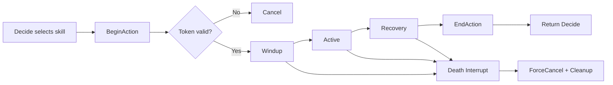

# Boss 技能释放流程文档 — MirrorAngel Boss (Stage 55)

> 配套 `BossAIStateMachine.md`。说明 Boss 技能 **不是直接播放动画**，而是走一套统一的 **决策 → 仲裁 → 前摇 → 释放 → 后摇 → 解锁** 流程。
> 本轮不重写技能、不改数值，仅文档化现有实现。

---

## 1. 技能走统一流程（不是直接播放）

Boss 任何技能都不能被「随手」播放。一次技能必须依次经过：

1. **Decide** — Brain 评分选技
2. **BeginAction** — 向 ActionController 申请动作锁，拿到 `actionToken`
3. **Windup** — 前摇（锁移动 / 锁朝向 / `IsCasting=true` / `AttackType=N`）
4. **Active** — 释放：伤害判定 / 位移 / 特效（LineRenderer、OverlapBox 等）
5. **Recovery** — 后摇
6. **EndAction(token)** — 释放动作锁，恢复移动 / 朝向 / 动画参数
7. **Death Interrupt** — 任意阶段 `boss.IsDead` → `ForceCancelAction` 强制清理

---

## 2. Decide：选择技能

`MirrorAngelBossBrain.DecideNextAction()`：

- 按距离区间过滤（`tooClose / preferredMin / preferredMax / farDistance`）。
- `ChooseBestSkill(distance)`：对候选池 `MirrorAngelBossSkillOption` 逐个 `ScoreSkill`
  （`baseWeight + rangeScore×5 − repeatPenalty(连续同技能) + Random(-1,1)`，且需 CD 就绪 + 距离命中 + 状态允许），取最高分。
- `attackChance=0.65`：即使有可用技能，也有概率改为 KeepDistance / Reposition（不死站桩）。
- 选中 → `StartSkill` → `CastSkillRoutine` 协程。

候选池（实际值）：`MirrorTripleBeam` / `MirrorAngelGroundRay` / `DoubleSlash` / `DoubleSlashDash` / `FarDashApproach` / `AirLaserMode`。

---

## 3~8. 单次技能的完整时序

`CastSkillRoutine(skill)`（Brain）+ 各技能 `CastRoutine`（Skill）：

```
3. BeginAction(actionType)
   - 若 IsActionLocked 或 boss.IsDead → 返回 token = -1 → 直接放弃（不抢占）
   - 否则 _actionToken++ → 锁定：IsCasting=true / AttackType=N / movementLock / facingLock(朝玩家)

4. Windup（前摇）
   - Brain: currentState=Windup，brainMovementLocked=true，DesiredMoveX=0
   - Skill: 播放对应动画（CastMirror / Attack1_GroundRay / Attack2_* / AirSubType），显示预警（如 TripleBeam 1s 红线）

5. Active（释放）
   - Brain: currentState=Casting（AirLaserMode → AirMode）
   - Skill: 伤害判定 —— Beam: CircleCast(playerLayer) 逐束；GroundRay: OverlapBox(X=100); DoubleSlash: 两段 OverlapBox; DashDash: 横劈 + 冲刺 MovePosition + 冲刺命中盒; AirLaser: 上升→悬停→激光 Raycast
   - 命中统一走玩家 Cardwin.Combat.Health.TakeDamage(int)

6. Recovery（后摇）
   - Skill: recoveryTime 等待
   - Brain: 协程 while(skill.IsCasting) 轮询，结束后进入 finally

7. EndAction(token)
   - token 与当前 _actionToken 不符 → no-op（防旧协程清掉新动作）
   - 匹配 → 解锁：IsCasting=false / AttackType=0 / movementUnlock / facingUnlock / 清 externalVelocity
   - Brain: currentState → Recovery → Idle，记录 lastUseTime/lastSkillId，排下次决策

8. Death（任意阶段）
   - boss.IsDead → 技能 Aborted()/EndCast 自解锁；Brain StopAllBossActions → ForceCancelAction（token++ 无条件清理）
```

---

## 9. 为什么要 ActionLock

- Boss 有 6 个动作来源（5 技能 + FarDash），若无锁，多个技能 / 移动会**同时写 Animator 与 Rigidbody2D**，互相覆盖。
- `ActionLock` 保证**同一时刻只有一个动作在跑**：`BeginAction` 已锁则返回 `-1`，新技能放弃，不抢占。
- `AnimatorBridge` 在 `IsActionLocked` 时直接 `return`，**不再用 Idle/Walk 覆盖攻击动画**（修复「攻击被 Walk/Idle 抢」）。
- `GravityMover` 在锁定 / AirLaser 分支让出 Rigidbody2D 控制权，避免移动把技能位移清零。

---

## 10. 为什么要 actionToken

- `_actionToken` 单调递增。`BeginAction` 自增并返回当前值，`EndAction(token)` 只在 **token 匹配** 时才解锁。
- 解决「旧协程清掉新动作」：若一个旧技能协程因延迟在新技能已 `BeginAction` 后才走到 `finally` 调 `EndAction(oldToken)`，因 token 不符而 **no-op**，不会误解锁新动作。
- `ForceCancelAction()`（死亡 / 卸载）也 `token++`，使任何在途旧协程的 `EndAction` 全部失效。

---

## 11. 常见 Bug 与本流程的防护

| Bug | 成因 | 本流程防护 |
|---|---|---|
| 攻击被 Walk/Idle 抢 | AnimatorBridge 每帧写 locomotion 覆盖攻击动画 | `IsActionLocked` 时 Bridge `return`，不写 Idle/Walk |
| 技能卡住 `IsCasting` | 协程异常退出未复位 | 技能用 `try/finally` + `OnDisable` 兜底 `EndCast`；Brain `finally` 必调 `EndAction` |
| 死亡后技能协程继续 | 协程不检查死亡 | 每个技能 `Aborted()`（`boss.IsDead`）逐帧检查 → `EndCast`；Brain 死亡 → `ForceCancelAction` |
| 旧协程清掉新动作 | 旧 `EndAction` 解锁了新技能 | `actionToken` 匹配校验，旧 token 的 `EndAction` no-op |

---

## 12. Mermaid 流程图



---

## 附：运行时可视化

`MirrorAngelBossDebugState`（Stage 55）在技能流程各阶段由 Brain 推送：
`Decide → Windup(SetSkill) → Casting/AirMode → Recovery(ClearSkill) → Decide`，
状态变化时打印 `[BossAI] State: X -> Y, reason=...`（低频，仅变化时）。
`ActionLocked` / `CurrentActionToken` 字段直接反映 ActionController 的锁与 token，便于排查上表 Bug。
